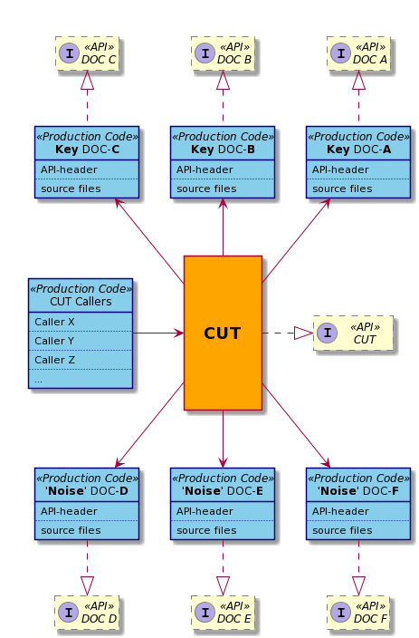
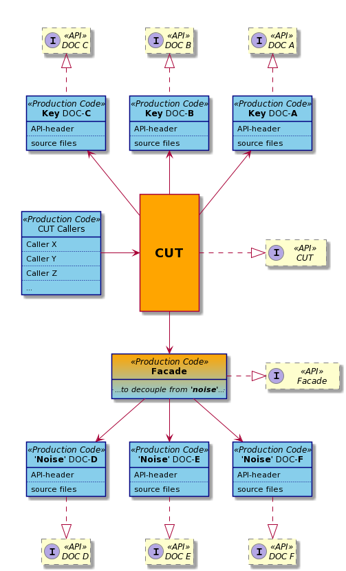
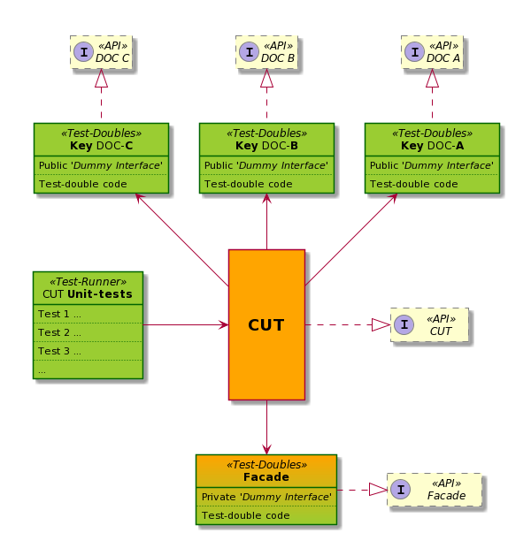

# STAT

## Introduction

STAT stands for <u>**ST**</u>and<u>**A**</u>lone unit-<u>**T**</u>esting 
framework. It was designed to support and encourage TDD with emphasis 
on embedded environments. This framework forks from an open source  
project [Unity](http://www.throwtheswitch.org/unity). The latter one can 
be found also on [GitHub](https://github.com/ThrowTheSwitch/Unity).  

The idea behind the design of STAT was to enable the TDD methodology 
in ad-hock conditions of a heavy-legacy codebase, with minimum 
requirements that are needed to integrate into the codebase, which 
originally neither comply with TDD nor practices its methods. 

### Terminology

* **CUT** - Code Under Test
    * a portion of production code, which has a 
    finite functional purpose and is being currently under test in the
    scope of referred unit-tests
* **DOC** - Dependent-On Component/Code  
    * another component (either SW or HW) that represents a dependency for
the given CUT
* **FW** - Firmware
* **TDD** - [Test-Driven Development](https://www.agilealliance.org/glossary/tdd)
    * see also [TDD](https://martinfowler.com/bliki/TestDrivenDevelopment.html)
    for more details

### Justification
It's quite common in the industry that a codebase does not change 
dramatically in a time-frame of a single project. The changes are rather 
local in nature and tones of legacy code are dragged from one project 
to another.  
With the embedded products the challenge gets even harder, since
these are not pure software solutions, but include many HW cores 
with interfaces that don't act exactly the same way as of software.  
In addition, these systems usually have many constraints, like memory, 
code-size, low CPU power and more. And these ones are known as not 
getting along that well with the best programming practices such as TDD. 
At least, we found it hard to convince some embedded-SW developers that 
TDD is even possible in such conditions, not to mention whether it is 
beneficial or not. Convincing managers is even harder. To prove added 
value of TDD, one needs to practice TDD before getting the approval and 
the support, which are required to practice it. What's a conundrum?  

We also found out that there were already several attempts in some other
groups to assimilate the TDD methodology. And these were not successful. 
Even, just unit-testing (not mandatory TDD) was quite tough. 
The unit-tests became overcomplicated with time, which made them
too fragile and sensitive to changes. Changing code or unit-test in one
place, was always breaking unit-tests in a completely different 
part of the code. These resulted from dependencies of the modules, 
which usually are much bigger in numbers than one could originally think.

If these was not enough, please note the following nuances that produce
really hard problems in addition to those mentioned above:

* It takes time to accept the mindset of "*tests drive the development*"
* It takes time to educate and to assimilate TDD into the workflow
* In big complex projects, it would take eternity to get rid of all 
legacy code
* Not everybody is willing to commit and/or to follow the methodology
    * Many teams &rArr; many ideologies/approaches/opinions
* Not all developers are equally skilled at unit-testing, 
at least not at the very beginning

We understood that the best way to make others follow is to start our 
own initiative without requesting from the rest of the system to comply.
To achieve this goal, first, we need to ensure some sort of isolation  
for the development of the TDD-compliant "isles" within the "sea" of 
the legacy non-compliant codebase.  
Even after the isles will take over and "dry out" the sea,
with only few lakes of legacy-code left, still such "isolation"
would provide flexibility and independence of development efforts.
Actually, if one follows the idea, one can see that it's not that
far from the concept of [***microservices***](https://microservices.io/). 

So, how does one do it under the constraints of the embedded environment 
and in the following conditions of the programming language like C: 

* no inherent tools like Interface to formalize and fixate APIs
* no function overloading (or default argument-values) to extend 
the existing APIs
* (and perhaps most important) no real support of dynamic polymorphism 
or any kind for that matter 

Though the latter perhaps could be resolved with the callbacks, which
requires strong commitment from all the development teams involved.
But the worst thing with the callbacks that one might find it very  
difficult to persuade especially those veteran embedded-developers that 
FW-overhead of callbacks does totally worth the benefit of having TDD.  
Please remember, all these has to come before we have actually persuaded 
the system (the management) to support TDD. Moreover, one shall 
recall and take into account that there are lots of legacy code, 
which yet comply, and there is no one yet willing to allow 
touching it seemingly for no justifiable reason.  
Now, one can imagine how deep the whole really is! 

### Goals

We tried several unit-test frameworks, and there are quite a few
really great products. So, we stated the following goals for the 
framework we were looking for:

* *Simplicity* – test-setup shall be simple, fast and intuitive
* *Speed* – compilation and execution shall be fast and focused 
  to support TDD short cycles and encourage refactoring
* *Lightweight* – it shall enable portability to embedded platforms 
  (we plan to support it in the future)
* *Comprehensive feedback* – better logging &rArr; 
  lesser step-by-step debugging &rArr; greater efficiency
  * R&D should really stand for Research and Development, 
    rather than for Research and Debugging  
* *Reproducibility*– tests shall be reproducible
  * Non-reproducible tests are nothing but annoying reminder for
  an existing bug that we fail to identify
* *Test-code sharing* – reduce the inevitable code-duplication 
  * Test-doubles contain word duplication in their very name.  
  * It'd be better to enable easy sharing of such components
* *Automation* – test automation shall be very simple to achieve
* <u>***CUT-Isolation***</u> – pure unit-testing without noise of 
  other FW-code, HW or OS
  * achieving static polymorphism to substitute the need of dynamic
  * reduction of DOC-s (dependent-on components)
  * standalone (per CUT) development

_The last one we found as most critical one for our needs due 
to constraints mentioned in the previous chapter._ This is 
were most of the evaluated solutions failed so far. But, there
were some simply technical reasons that also made frameworks
existing at that time less suitable. Our lab machines were
beyond control of our team, and they were equipped with 
Python 2.7, MS Visual Studio and our target build toolchain.
No Rubi, lua, CMake or any other things of that kind.

### Unity Harness

Eventually, we decided to build our own framework that will fit
the bill. Despite that decision we also understood that though
the evaluated frameworks couldn't fit all of our requirements,  
there are still those ones that are very close. 
[Unity](http://www.throwtheswitch.org/unity) harness was 
that great almost-match, and thus we decided to build ours 
based on it due to the following clear advantages of 
the Unity harness:

* Minimalistic in size and dependencies on system libraries
* Can be compiled almost on any platform
* Provides rich and strong assertion mechanism
* Prints very comprehensive logging and results
* Tolerant to test-failures
    * Failing test (if properly built) doesn't crash the
    subsequent tests 

An additional advantage worthy of a separate discussion is
the very fact that Unity is written in C. This is the same
language we use to write our production code.  
It is  better to prevent developers from constantly 
switching between different language paradigms. 
In addition, writing in the same language gives a developer 
the same sense of experience whether writing production code or 
unit-test code. 

## Theoretical Background

### Reverse Polymorphism by Compilation

Unlike many OO languages, C doesn't have an inherent methods
of implementing dynamic polymorphism. But, dynamic polymorphism 
is a strong tool that allows substitution of product versions 
of DOCs with test-doubles.   
Of course we can achieve the same effect with the manual 
workaround. We can implicitly implement the `vTable` and 
initialize it with callback functions either of production 
code or of test-doubles. Sounds like a good solution, but 
there are several problems with this method though:
* In embedded environment function pointers many times are not an option 
    * It might produce unacceptable overhead penalty
    * It forces limits on the usage of inline functions and macros
* This method also assumes that all DOCs comply 
    * It is not the cases for us, and it canned be enforced 
    (as it was explained above)
* The stated conditions also assume tones of legacy code,
which doesn't comply by definition
* And in general, any method that cannot be forced by language
might become a fragile liability 

Then, the next best thing would be static polymorphism. But it has many
of the weak-points that we already pointed out for the dynamic 
polymorphism.

Eventually, we solved the issue with some sort of *Reverse Polymorphism 
by Compilation*.  
Many header files (that in C serve some sort of interfaces) are 
"contaminated" with partial implementations, e.g. 
inline functions, macros. Even if had enforced a methodology of 
constraining the header files from having any implementation-specific
data, still we would have had a problem with the legacy headers.
There are too many of those and we can't touch them in our case.
Moreover, this is not something that you can enforce in C and thus,
it would be hard to maintain and to ensure especially in a big-scale
projects with a cross-sites team.

#### *Dummy Interfaces*

Instead of constraining the header files we instruct developers
to create a header-file prototype for DOC API header-files
if needed. The former would be a very simplified version of the latter.
We named it *Dummy Interface*. It works as if a *Dummy Interface* 
was a real Interface from which the related DOC derives its 
implementation. *Dummy Interface* contains no implementation, e.g.:

* Each inline is substituted with non-inline prototype
* Each macro is redirected to a non-inline function of similar name

Note that the *Dummy Interface* doesn't have to contain every object
that the original function does. The developers are instructed to
work similar to open-source community - each developer adds to
a given *Dummy Interface* only what he/she needed. The other 
developers will add the rest upon demand.

STAT framework has built-in mechanisms that allow simple overriding
of original header files with their *Dummy Interface* versions, 
either for all test-packages at once, or for each test-package 
separately.

### CUT Isolation

#### *Dependencies/DOC*

One of the problems in unit-testing is resolving the dependencies
of the given CUT. In embedded environment the problem gets even more
complicated by the fact that the product is not pure software.
However, the challenge is not only limited to HW-related issues.

Without substituting the DOCs with test-doubles, unit-testing might
become a real nightmare in many aspects, e.g. complexity, timing,
maintainability. Such tests would be very fragile and hardly 
scalable.

Another challenge is the amount of DOCs. One might say that with 
appropriate design really noticeable DOCs shall be few in number.
While it's correct regarding the key DOCs, many times there are 
lots of insignificant dependencies, usually dispersed over 
many system components (e.g. logging, system calls).  

If the product architecture comprises more then on CPU, in 
embedded most likely it would be AMP architecture 
(Asymmetric Multiprocessing). It complicates things even more. 
If the product has OS, it also adds extra challenges to unit-testing.

#### *'Noise' Dependencies*

Not all of the dependencies are equal from perspective of each
given CUT: 

* There are key dependencies, which define the end-to-end
use-cases/flows of CUT
* There are non-key dependencies, which do not define
the major functionality of CUT
* There are also 'inconvenient' dependencies, which might
serve as key dependency, but are hard to deal with
    * Usually, these are heavy-legacy components, e.g. overloaded
      with things like macros, strongly coupled APIs

The latter two types of DOC are usually responsible for 
fragile nature of unit-test packages, if not dealt with correctly.
We call these '***Noise***' dependencies.  
Let's see the following example of CUT relationships with 
its DOCs in a production code.  

  

>On the figure above, one can see that the CUT has six DOCs:
>A,B and C are key dependencies and D, E, and F got 
>identified as 'noise' dependencies. In C there are no
>built-in interfaces. Even header files (especially legacy)
>might contain partial implementation. In embedded 
>environment, performance consideration might drive in
>favor of such decision (e.g. inline API functions). 
>Therefore, the interfaces are denoted virtually on 
>the figure (highlighted with dashed lines). 
 
#### *Noise Reduction/Decoupling*

Decoupling a given CUT from its '*Noise*' DOCs improves 
its testability. The following figure shows how 
design-pattern '*Facade*' can be used to achieve this 
goal.

 

>We simply put a header files between CUT and all
>its '*Noise*' DOCs. Now, it can be seen by looking
>at interface items on the figure that CUT now 
>depends only on four interfaces, rather then six.
>By the way, '*Facade*' is not the only design-pattern
>suitable for the job. 
>
>>The '*Adapter*' design-pattern can be used to 
>>simplify or convert complicated DOC APIs.  
>>The '*Strategy*' design-pattern can be used
>>to resolve a use-case when different DOC APIs
>>shall be called depending on strategy (which
>>might appear in a form of enumeration).  
>
>For the sake of simplicity, let's name all
>these substitutions after the name of '*Facade*'.

#### *Unit-test Package*

Now, when dependencies have been reduce to a 
reasonable minimum the test-package for the CUT
would have the following view.

  

>Please note that real DOC headers got replaced with
>dummy interfaces and DOCs with test-doubles.  
>Moreover, the test-package environment seems much 
>simpler then it could have without '*Facade*'. 

### Summary

The technique described above we call '*CUT-Isolation*'. 
Along with the concept of '*Dummy Interfaces*' it proved
itself throughout the years, during which we honed and 
polished this methodology.  
STAT-framework evolved along this entire process, 
deriving its design from the experience we gained.
It is built to ensure very simple and quick setup of 
unit-tests and to be very convenient for practicing TDD.
And all this in conditions of heavy legacy code-base and
with minimal requirements (if any) for integration to
the development environment.  
It helped us to establishing the isles of TDD in our 
code-base and to start gradual expansion of TDD over 
the entire code-base.

## Overview
### Order of Inclusion

#### *Public Dummy Interfaces*

STAT supports this approach by providing a dedicated method
of maintaining *Dummy Interfaces* in a centralized location
(to prevent excessive duplication) and overrides a real 
header file, if such one appear on an include path of the unit-test
package.

As noted above, each dummy interface explicitly declared for 
the given test-package overrides any other instance of the
header files of the same name, whether such one can or cannot
be located on the include path.

#### *Private Dummy Interfaces*

In addition to DOC public APIs, there is a need to substitute 
certain internal header-files too. For instance, this could be
a header-file designed as a *facade* intended to decouple the
given CUT from certain system components.  
It makes sense to place dummy interfaces of public APIs in 
a single central location which is accessible to all 
test-packages, as it helps to reduce duplication. 
Whereas, dummy interfaces of internal APIs should be kept 
locally for each test package, as these are less likely 
to be accessed by other test-packages. 
 
For that purpose, STAT framework is enhanced with a dedicated 
mechanism. For each header-file it insures to include that 
instance, which appears first on the include-patch. The order
is defined to the one the directories are mentioned for
the given test-package. It works even if the header-file 
is included by other header files that are located in the 
same directory. It is achieved by symbol-linking or copying
the header-files into a dedicated single directory.

<!--
Notes: 
- Shared Test Doubles
- Product makefiles vs. test-package makefiles
 - System Headers and Common Dependencies

//-->